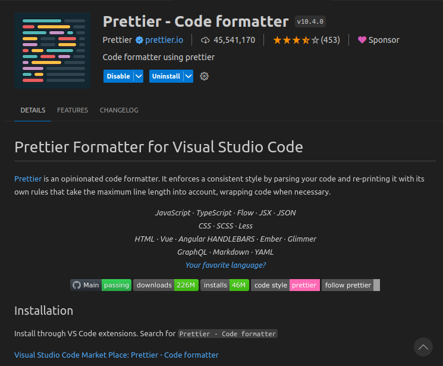
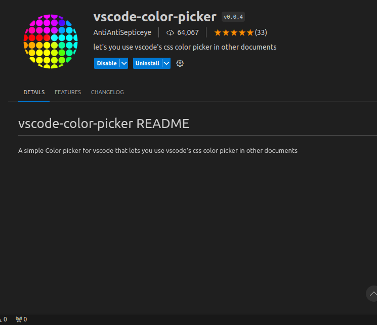
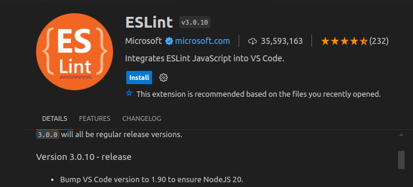
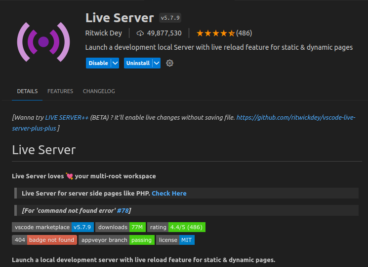
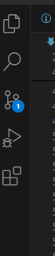
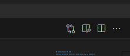
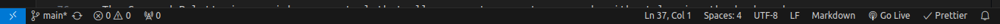

## Installation of VS Code

### Steps to Download and Install Visual Studio Code on Windows 11:

1. **Download VS Code:**

   - Visit the [Visual Studio Code download page](https://code.visualstudio.com/).
   - Visit and Read this https://code.visualstudio.com/docs/setup/windows .
   - Click on the "Download for Windows" button. This will download the installer file (`VSCodeUserSetup-x64-<version>.exe`).

2. **Run the Installer:**
   - Double-click the downloaded `.exe` file to run the installer.
   - Follow the installation prompts:
     - Accept the license agreement.
     - Choose the destination location.
     - Select additional tasks (e.g., creating a desktop icon, adding to PATH).
   - Click "Install" to complete the installation process.

### Prerequisites:

- **Operating System:** Windows 11.
- **Administrator Privileges:** Required to install software.

## First-time Setup

### Initial Configurations and Settings:

1. **Theme and Appearance:**

   - Go to `File > Preferences > Theme > Color Theme` to choose a theme (e.g., Dark+, Light+, Monokai).
   - Alternatively use keyboard shortcut `Ctrl + K Ctrl + T`.

2. **Font and Editor Settings:**

   - Navigate to `File > Preferences > Settings`.
   - Adjust font size and family: `Text Editor > Font`.
   - Enable line numbers and word wrap: `Text Editor > General`.

3. **Extensions:**
   - Open the Extensions view by clicking the Extensions icon in the Activity Bar or pressing `Ctrl+Shift+X`.
   - Install recommended extensions for your language or framework (e.g.Prettier - Code formatter).

### Important Extensions:

- **Prettier:** Code formatter.

- **Vscode Color Picker**simple Color picker for vscode that lets you use vscode's css color picker in other documents

- **ESLint:** Linting JavaScript/TypeScript.

- **Live Server:** Local development server with live reload.

## User Interface Overview

### Main Components:

1. **Activity Bar:**

   - Located on the far left.
   - Provides access to different views such as Explorer, Search, Source Control, Run and Debug, and Extensions.

2. **Side Bar:**

   - Displays the selected view from the Activity Bar (e.g., Explorer, Search results).
   - Used for navigating project files and folders.

   

3. **Editor Group:**

   - The central area where files are opened and edited.
   - Supports multiple tabs and split views for side-by-side editing.

   

4. **Status Bar:**

   - Located at the bottom of the window.
   - Displays information about the current file, such as language mode, encoding, and line/column number.
   - Provides shortcuts to key settings and tasks (e.g., Git status, Errors and Warnings).

   

## Command Palette

### What is the Command Palette:

- The Command Palette is a quick-access tool that allows you to execute commands without leaving the keyboard.

### Accessing the Command Palette:

- Press `Ctrl+Shift+P` (Windows/Linux) .

### Common Tasks:

- **Open settings:** `Preferences: Settings`.
- **Change theme:** `Preferences: Theme > Color Theme`.
- **Install extensions:** `Extensions: Install Extensions`.
- **Run tasks:** `Tasks: Run Task`.

## Extensions in VS Code

### Role of Extensions:

- Enhance the functionality of VS Code by adding features like language support, debuggers, and tools.

### Finding and Installing Extensions:

1. Open the Extensions view (`Ctrl+Shift+X`).
2. Search for the desired extension.
3. Click "Install" to add it to your VS Code.

### Managing Extensions:

- Disable or uninstall extensions from the Extensions view.
- Update extensions by clicking the update button in the Extensions view.

### Essential Extensions for Web Development:

- HTML, CSS, and JavaScript Snippets.
- Prettier - Code formatter.
- ESLint.
- Live Server.

## Integrated Terminal

### Opening and Using the Integrated Terminal:

1. Open the terminal: `View > Terminal` or press `` Ctrl+` ``.
2. Use the terminal as you would an external terminal (e.g., run commands like `npm install`).

### Advantages:

- Integrated environment: Access terminal within the editor.
- Synchronization: Terminal opens in the project root.
- Multiple terminals: Support for multiple terminal tabs and splits.

## File and Folder Management

### Creating, Opening, and Managing Files and Folders:

1. **Create a New File/Folder:**

   - Right-click in the Explorer view and select `New File` or `New Folder`.
   - Use the `File > New File` menu option or press `Ctrl+N`.

2. **Open a File/Folder:**

   - Drag and drop files/folders into the Explorer.
   - Use `File > Open Folder` to open an entire project directory.

3. **Navigating Between Files:**
   - Use the Explorer view.
   - Quick Open with `Ctrl+P`.
   - Use breadcrumbs in the Editor Group to navigate file paths.

## Settings and Preferences

### Customizing Settings:

1. **Open Settings:**

   - `File > Preferences > Settings` or `Ctrl+,`.

2. **Change Theme:**

   - `File > Preferences > Theme > Color Theme`.

3. **Adjust Font Size:**

   - Search for `editor.fontSize` in settings and set the desired value.

4. **Change Keybindings:**
   - `File > Preferences > Keyboard Shortcuts` or `Ctrl+K Ctrl+S`.

## Debugging in VS Code

### Setting Up and Starting Debugging:

1. **Open the Debug View:**

   - Click the Run and Debug icon in the Activity Bar or press `Ctrl+Shift+D`.

2. **Configure Debugging:**

   - Click `create a launch.json file` to configure the debugger for your environment (e.g., Node.js, Python).

3. **Set Breakpoints:**

   - Click in the gutter next to the line numbers in the editor.

4. **Start Debugging:**
   - Press `F5` to start debugging.
   - Use the Debug toolbar to control the debugging session (e.g., Step Over, Step Into).

### Key Debugging Features:

- Breakpoints and Watches.
- Call Stack and Variables view.
- Debug Console.

## Using Source Control

### Integrating Git with VS Code:

1. **Initialize a Repository:**

   - Open the Source Control view by clicking the Source Control icon in the Activity Bar.
   - Click `Initialize Repository` to create a new Git repository.

2. **Making Commits:**

   - Stage changes by clicking the `+` icon next to the file.
   - Enter a commit message and click the checkmark icon to commit.

3. **Pushing Changes to GitHub:**
   - Open the Command Palette and type `Git: Add Remote`.
   - Enter the GitHub repository URL.
   - Push changes using `Git: Push`.
